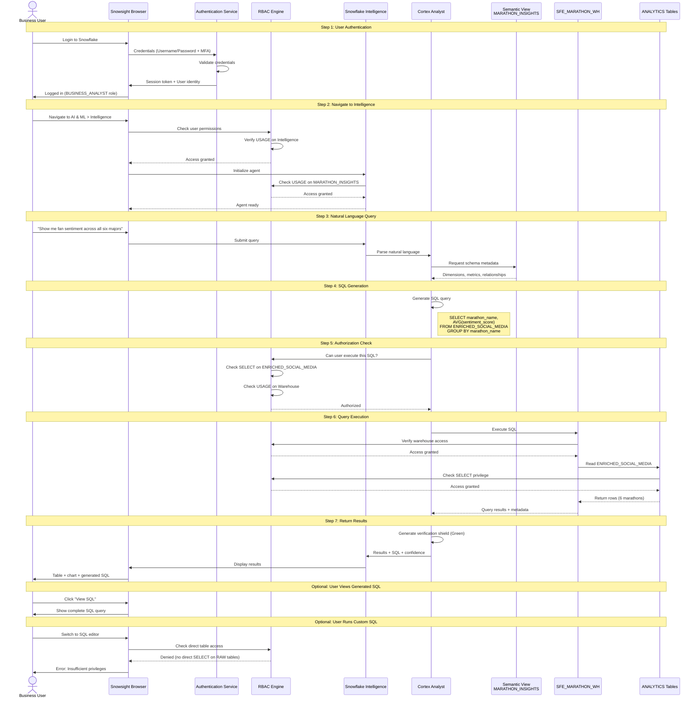

# Auth Flow - Global Marathon Analytics Demo

**Author:** SE Community  
**Last Updated:** 2025-11-25  
**Expires:** 2025-12-25  
**Status:** Reference Implementation


**Reference Implementation:** This code demonstrates production-grade architectural patterns and best practices. Review and customize security, networking, and business logic for your organization's specific requirements before deployment.

---

## Overview

This diagram shows the authentication, authorization, and access control flow for the Global Marathon Analytics demo, including role-based access control (RBAC), semantic view permissions, and Snowflake Intelligence query execution security.

---

## Diagram



---

## Component Descriptions

### Authentication Layer

**Component:** Authentication Service  
**Purpose:** Verify user identity before granting access  
**Technology:** Snowflake native authentication + optional SSO  
**Location:** Snowflake account level  
**Methods:**
- Username + Password (with optional MFA)
- Key-pair authentication (for CLI)
- OAuth 2.0 (for applications)
- SAML 2.0 (for SSO integration)

**Security Features:**
- Password complexity requirements
- Account lockout after failed attempts
- Session timeout after inactivity
- Multi-factor authentication (MFA) support

---

### Role-Based Access Control (RBAC)

**Component:** RBAC Engine  
**Purpose:** Control what authenticated users can access and do  
**Technology:** Snowflake native RBAC (hierarchical role system)  
**Location:** Account-level metadata  
**Granularity:** Database, schema, table, column, view, warehouse

**Role Hierarchy (Demo):**

```
ACCOUNTADMIN (System admin)
    ↓
SYSADMIN (Infrastructure admin)
    ↓
DATA_ENGINEER (Developer role)
    ↓
BUSINESS_ANALYST (End-user role)
```

**Privilege Types:**
- **USAGE:** Access to warehouse, database, schema, semantic view
- **SELECT:** Read data from tables/views
- **INSERT/UPDATE/DELETE:** Modify data
- **CREATE:** Create new objects
- **OWNERSHIP:** Full control over object

---

### Demo Role Configuration

#### ACCOUNTADMIN Role (Setup Only)

**Purpose:** Deploy demo infrastructure  
**Privileges:**
```sql
-- Can create warehouse
CREATE WAREHOUSE SFE_MARATHON_WH;

-- Can create database
CREATE DATABASE SNOWFLAKE_EXAMPLE;

-- Can grant privileges to other roles
GRANT USAGE ON DATABASE SNOWFLAKE_EXAMPLE TO ROLE BUSINESS_ANALYST;
```

**When to Use:** Setup scripts, teardown, debugging  
**Security:** Highly restricted, MFA required (production)

#### BUSINESS_ANALYST Role (Demo Users)

**Purpose:** Query data via Snowflake Intelligence  
**Privileges:**
```sql
-- Warehouse usage (execute queries)
GRANT USAGE ON WAREHOUSE SFE_MARATHON_WH TO ROLE BUSINESS_ANALYST;

-- Database and schema access
GRANT USAGE ON DATABASE SNOWFLAKE_EXAMPLE TO ROLE BUSINESS_ANALYST;
GRANT USAGE ON SCHEMA ANALYTICS TO ROLE BUSINESS_ANALYST;

-- Semantic view access (no direct table access)
GRANT USAGE ON SEMANTIC VIEW ANALYTICS.MARATHON_INSIGHTS TO ROLE BUSINESS_ANALYST;

-- Cortex AI functions (for Intelligence)
GRANT DATABASE ROLE SNOWFLAKE.CORTEX_USER TO ROLE BUSINESS_ANALYST;
```

**What They Can Do:**
- Ask natural language questions via Intelligence
- View generated SQL queries
- Access data through semantic view only

**What They Cannot Do:**
- Query RAW_INGESTION tables directly
- Create new objects
- Grant privileges to others
- See other users' query history

#### DATA_ENGINEER Role (Maintenance)

**Purpose:** Develop and maintain demo  
**Privileges:** All BUSINESS_ANALYST privileges, plus:
```sql
-- Direct table access for development
GRANT SELECT ON ALL TABLES IN SCHEMA RAW_INGESTION TO ROLE DATA_ENGINEER;
GRANT SELECT ON ALL TABLES IN SCHEMA STAGING TO ROLE DATA_ENGINEER;
GRANT SELECT ON ALL TABLES IN SCHEMA ANALYTICS TO ROLE DATA_ENGINEER;

-- Create objects for development
GRANT CREATE TABLE ON SCHEMA ANALYTICS TO ROLE DATA_ENGINEER;
GRANT CREATE VIEW ON SCHEMA STAGING TO ROLE DATA_ENGINEER;

-- Modify semantic view
GRANT ALTER ON SEMANTIC VIEW ANALYTICS.MARATHON_INSIGHTS TO ROLE DATA_ENGINEER;
```

---

## Authentication Flows

### Flow 1: Web UI Authentication (Snowsight)

```
1. User navigates to https://<account>.snowflakecomputing.com
2. Browser redirects to login page
3. User enters username + password
4. (Optional) MFA prompt (6-digit code or push notification)
5. Authentication service validates credentials
6. Session token generated (expires after inactivity)
7. User lands on Snowsight home page
8. Default role: BUSINESS_ANALYST (lowest granted role)
```

**Session Management:**
- Token stored in secure HTTP-only cookie
- Expires after 30 minutes of inactivity (default)
- Explicit logout clears token immediately

### Flow 2: CLI Authentication (SnowSQL)

```
1. User runs: snowsql -a <account> -u <username>
2. SnowSQL prompts for password
3. Credentials sent over TLS connection
4. Authentication service validates
5. Session established (persists until `!exit`)
```

**Alternative:** Key-pair authentication (no password needed)
```sql
-- Generate key pair locally
openssl genrsa 2048 | openssl pkcs8 -topk8 -inform PEM -out rsa_key.p8 -nocrypt
openssl rsa -in rsa_key.p8 -pubout -out rsa_key.pub

-- Assign public key to user
ALTER USER data_engineer SET RSA_PUBLIC_KEY='MIIBIjANBg...';

-- Connect with private key
snowsql -a <account> -u data_engineer --private-key-path rsa_key.p8
```

---

## Authorization Flows

### Flow 1: Snowflake Intelligence Query

**Step-by-Step Authorization Checks:**

1. **User Access to Intelligence:**
   ```sql
   -- Checked when user opens Intelligence interface
   -- Granted via ACCOUNTADMIN during setup
   GRANT USAGE ON APPLICATION SNOWFLAKE_INTELLIGENCE TO ROLE BUSINESS_ANALYST;
   ```

2. **Semantic View Access:**
   ```sql
   -- Checked when agent connects to MARATHON_INSIGHTS
   GRANT USAGE ON SEMANTIC VIEW ANALYTICS.MARATHON_INSIGHTS TO ROLE BUSINESS_ANALYST;
   ```

3. **Warehouse Usage:**
   ```sql
   -- Checked when query is executed
   GRANT USAGE ON WAREHOUSE SFE_MARATHON_WH TO ROLE BUSINESS_ANALYST;
   ```

4. **Table Access (Implicit via Semantic View):**
   - User does NOT need direct SELECT on ANALYTICS.ENRICHED_SOCIAL_MEDIA
   - Semantic view acts as security layer (view runs with OWNER's rights)
   - Owner (ACCOUNTADMIN or DATA_ENGINEER) has SELECT on tables
   - User inherits access through semantic view

**Security Benefit:** Users can query data without seeing raw tables or underlying schema.

### Flow 2: Direct SQL Query (Blocked)

**Scenario:** Business user tries to query raw table directly

```sql
-- User switches to SQL editor and tries:
SELECT * FROM SNOWFLAKE_EXAMPLE.RAW_INGESTION.SOCIAL_MEDIA_POSTS;
```

**Authorization Check:**
```
1. RBAC checks: Does BUSINESS_ANALYST have SELECT on RAW_INGESTION.SOCIAL_MEDIA_POSTS?
2. Result: NO
3. Error returned: "SQL access control error: Insufficient privileges"
```

**Correct Approach:** Use semantic view
```sql
-- This works (semantic view provides abstraction)
SELECT * FROM SNOWFLAKE_EXAMPLE.ANALYTICS.MARATHON_INSIGHTS;
-- Or use Intelligence natural language
```

---

## Semantic View Security Model

### Owner's Rights Execution

**Key Concept:** Semantic views execute with the privileges of their OWNER, not the caller.

**Example:**
```sql
-- Semantic view created by DATA_ENGINEER role
USE ROLE DATA_ENGINEER;
CREATE SEMANTIC VIEW ANALYTICS.MARATHON_INSIGHTS AS (...);

-- DATA_ENGINEER has SELECT on ANALYTICS.ENRICHED_SOCIAL_MEDIA
GRANT SELECT ON ANALYTICS.ENRICHED_SOCIAL_MEDIA TO ROLE DATA_ENGINEER;

-- Business user only needs USAGE on semantic view
USE ROLE ACCOUNTADMIN;
GRANT USAGE ON SEMANTIC VIEW ANALYTICS.MARATHON_INSIGHTS TO ROLE BUSINESS_ANALYST;

-- When BUSINESS_ANALYST queries via Intelligence:
-- 1. User has USAGE on semantic view → Access granted
-- 2. Semantic view runs with DATA_ENGINEER's privileges → Can read tables
-- 3. Results returned to user
```

**Security Benefit:**
- Business users don't need table-level access
- Reduces privilege sprawl
- Centralized access control via semantic view

**Risk:** Over-permissive semantic views could expose sensitive data

**Mitigation:**
- Design semantic views to expose only necessary columns
- Use WHERE clause filters in semantic view definition
- Apply row-level security policies on underlying tables

---

## Cortex AI Permissions

### CORTEX_USER Database Role

**Purpose:** Grant access to Cortex AI functions  
**Required For:** SENTIMENT(), SUMMARIZE(), COMPLETE(), etc.  
**Scope:** Account-level database role in SNOWFLAKE database

**Grant Pattern:**
```sql
USE ROLE ACCOUNTADMIN;
GRANT DATABASE ROLE SNOWFLAKE.CORTEX_USER TO ROLE BUSINESS_ANALYST;
```

**What This Enables:**
- Call Cortex functions from SQL
- Use Snowflake Intelligence (requires Cortex Analyst)
- No additional cost beyond function usage

**Security Note:** CORTEX_USER does NOT grant data access, only AI function access.

---

## Query Execution Security

### Step-by-Step Authorization Flow

**Example Query:** `"Show me fan sentiment across all six majors"`

```
1. User submits natural language query
   ↓
2. Intelligence checks: Does user have USAGE on MARATHON_INSIGHTS?
   - Yes → Continue
   - No → Error: "You don't have access to this semantic view"
   ↓
3. Cortex Analyst generates SQL:
   SELECT marathon_name, AVG(sentiment_score)
   FROM ANALYTICS.ENRICHED_SOCIAL_MEDIA
   GROUP BY marathon_name
   ↓
4. RBAC checks: Does semantic view owner have SELECT on ENRICHED_SOCIAL_MEDIA?
   - Yes → Continue (owner's rights)
   - No → Error: "Semantic view cannot access underlying tables"
   ↓
5. Warehouse check: Does user have USAGE on SFE_MARATHON_WH?
   - Yes → Continue
   - No → Error: "Insufficient privileges to use warehouse"
   ↓
6. Query executes
   ↓
7. Results returned to user with verification shield
```

**Total Checks:** 3 authorization points  
**Failure Mode:** Fail-safe (deny by default)

---

## Audit & Compliance

### Query History Auditing

**All queries are logged:**
```sql
SELECT 
  user_name,
  role_name,
  query_text,
  execution_status,
  start_time,
  end_time,
  warehouse_name
FROM SNOWFLAKE.ACCOUNT_USAGE.QUERY_HISTORY
WHERE user_name = 'BUSINESS_USER'
  AND start_time >= DATEADD('day', -7, CURRENT_TIMESTAMP())
ORDER BY start_time DESC;
```

**Compliance Benefits:**
- Full audit trail of who queried what data
- Timestamp tracking for investigation
- Role context for privilege analysis

### Access History Auditing

**Track object access:**
```sql
SELECT 
  user_name,
  objects_accessed,
  query_text
FROM SNOWFLAKE.ACCOUNT_USAGE.ACCESS_HISTORY
WHERE objects_accessed LIKE '%ENRICHED_SOCIAL_MEDIA%'
  AND query_start_time >= DATEADD('day', -7, CURRENT_TIMESTAMP());
```

**Use Cases:**
- Data lineage tracking
- Compliance reporting (GDPR, HIPAA)
- Security incident investigation

---

## Security Best Practices (Production)

### 1. Implement Least Privilege

**Anti-Pattern:**
```sql
-- Granting too much access
GRANT ALL PRIVILEGES ON DATABASE SNOWFLAKE_EXAMPLE TO ROLE BUSINESS_ANALYST;
```

**Best Practice:**
```sql
-- Grant only what's needed
GRANT USAGE ON DATABASE SNOWFLAKE_EXAMPLE TO ROLE BUSINESS_ANALYST;
GRANT USAGE ON SCHEMA ANALYTICS TO ROLE BUSINESS_ANALYST;
GRANT USAGE ON SEMANTIC VIEW ANALYTICS.MARATHON_INSIGHTS TO ROLE BUSINESS_ANALYST;
```

### 2. Enable Multi-Factor Authentication

```sql
-- Require MFA for admin roles
ALTER USER admin_user SET MINS_TO_BYPASS_MFA = 0;

-- Enforce MFA for all users (account-level setting)
ALTER ACCOUNT SET REQUIRE_MFA = TRUE;
```

### 3. Implement Network Policies

```sql
-- Restrict access to corporate IP ranges
CREATE NETWORK POLICY corp_access
  ALLOWED_IP_LIST = ('192.168.1.0/24', '10.0.0.0/8');

-- Apply to account
ALTER ACCOUNT SET NETWORK_POLICY = corp_access;
```

### 4. Use Row Access Policies (If Needed)

**Scenario:** Multi-tenant semantic view where users should only see their own marathon data

```sql
-- Create row access policy
CREATE ROW ACCESS POLICY user_marathon_access AS (marathon_id NUMBER) RETURNS BOOLEAN ->
  CASE
    WHEN CURRENT_ROLE() = 'TOKYO_ADMIN' THEN marathon_id = 1
    WHEN CURRENT_ROLE() = 'BOSTON_ADMIN' THEN marathon_id = 2
    ELSE FALSE
  END;

-- Apply to table
ALTER TABLE ANALYTICS.ENRICHED_SOCIAL_MEDIA 
  ADD ROW ACCESS POLICY user_marathon_access ON (marathon_id);
```

### 5. Monitor for Privilege Escalation

```sql
-- Alert on privilege grants to sensitive roles
SELECT 
  granted_to,
  grantee_name,
  privilege,
  granted_on,
  name
FROM SNOWFLAKE.ACCOUNT_USAGE.GRANTS_TO_ROLES
WHERE granted_to = 'ROLE'
  AND grantee_name IN ('BUSINESS_ANALYST', 'PUBLIC')
  AND privilege IN ('OWNERSHIP', 'ALL PRIVILEGES')
ORDER BY created_on DESC;
```

---

## Threat Model & Mitigations

### Threat 1: Unauthorized Data Access

**Risk:** User tries to access raw tables without permission  
**Mitigation:** RBAC denies access, query fails immediately  
**Detection:** Logged in QUERY_HISTORY with error status

### Threat 2: Privilege Escalation

**Risk:** User attempts to GRANT themselves higher privileges  
**Mitigation:** Only roles with MANAGE GRANTS can grant privileges  
**Detection:** All grants logged in GRANTS_TO_ROLES

### Threat 3: SQL Injection via Intelligence

**Risk:** User crafts query to inject malicious SQL  
**Mitigation:** Cortex Analyst sanitizes inputs, generates parameterized SQL  
**Detection:** Query validation fails, never reaches warehouse

### Threat 4: Data Exfiltration

**Risk:** User exports large amounts of sensitive data  
**Mitigation:** 
- Rate limiting on query results
- Monitor large exports via ACCESS_HISTORY
- Implement data masking policies for PII

**Detection:** Query history shows large result sets

---

## Disaster Recovery for Security

### Compromised Credentials

**Response:**
```sql
-- Immediately disable user
ALTER USER compromised_user SET DISABLED = TRUE;

-- Revoke all active sessions
ALTER USER compromised_user SET MINS_TO_UNLOCK = 999999;

-- Audit what they accessed
SELECT * FROM SNOWFLAKE.ACCOUNT_USAGE.QUERY_HISTORY
WHERE user_name = 'COMPROMISED_USER'
  AND start_time >= DATEADD('day', -30, CURRENT_TIMESTAMP());
```

### Accidental Privilege Grant

**Response:**
```sql
-- Revoke incorrect grant immediately
REVOKE ALL PRIVILEGES ON DATABASE SNOWFLAKE_EXAMPLE FROM ROLE WRONG_ROLE;

-- Audit who was affected
SELECT * FROM SNOWFLAKE.ACCOUNT_USAGE.GRANTS_TO_ROLES
WHERE granted_on = 'DATABASE' 
  AND name = 'SNOWFLAKE_EXAMPLE'
  AND deleted_on IS NULL;
```

---

## Change History

See `.cursor/DIAGRAM_CHANGELOG.md` for version history and architecture decisions.

---

**Last Updated:** 2025-11-25  
**Related:** See `network-flow.md` for infrastructure architecture, `data-flow.md` for data pipeline

