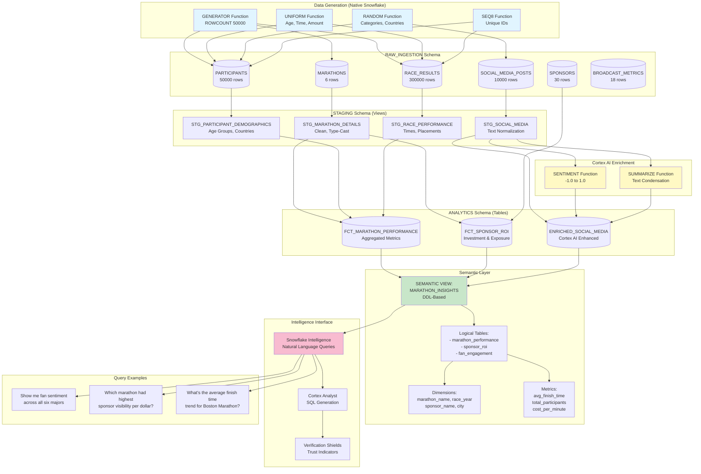

# Data Flow - Global Marathon Analytics Demo

**Author:** Michael Whitaker  
**Last Updated:** 2025-11-17  
**Status:** Reference Implementation


**Reference Implementation:** This code demonstrates production-grade architectural patterns and best practices. Review and customize security, networking, and business logic for your organization's specific requirements before deployment.

---

## Overview

This diagram shows how marathon data flows through the system, from synthetic generation using native Snowflake functions through transformation layers to the semantic view that powers Snowflake Intelligence natural language queries.

---

## Diagram



---

## Component Descriptions

### Data Generation Layer

**Component:** GENERATOR() Function  
**Purpose:** Generate bulk synthetic data without external dependencies  
**Technology:** Native Snowflake table function  
**Location:** `sql/02_data_generation/*.sql`  
**Dependencies:** None (native Snowflake)

**Example:**
```sql
SELECT * FROM TABLE(GENERATOR(ROWCOUNT => 50000))
```

**Component:** UNIFORM() Function  
**Purpose:** Generate random numeric values within specified ranges  
**Technology:** Native Snowflake random distribution function  
**Usage:** Ages (18-75), finish times (180-300 min), contract values ($100K-$5M)

**Component:** RANDOM() Function  
**Purpose:** Generate random categorical data with seeds for reproducibility  
**Technology:** Native Snowflake pseudo-random generator  
**Usage:** Gender, country, experience level, social media platform

**Component:** SEQ8() Function  
**Purpose:** Generate unique sequential identifiers  
**Technology:** Native Snowflake sequence function  
**Usage:** participant_id, result_id, post_id

---

### RAW_INGESTION Schema

**Component:** Landing Zone Tables  
**Purpose:** Store unmodified generated data  
**Technology:** Snowflake permanent tables with COMMENT metadata  
**Location:** `sql/02_data_generation/*.sql`  
**Dependencies:** Database and schema created by setup scripts

**Tables:**
- **MARATHONS:** 6 records (Tokyo, Boston, London, Berlin, Chicago, NYC)
- **PARTICIPANTS:** 50,000 synthetic runner profiles
- **RACE_RESULTS:** 300,000 results over 3 years
- **SPONSORS:** 30 sponsor companies
- **SOCIAL_MEDIA_POSTS:** 10,000 fan posts
- **BROADCAST_METRICS:** 18 records (6 marathons × 3 years)

---

### STAGING Schema

**Component:** Transformation Views  
**Purpose:** Clean, type-cast, and prepare data for analytics  
**Technology:** Snowflake views (no storage duplication)  
**Location:** `sql/03_transformations/01_staging_views.sql`  
**Dependencies:** RAW_INGESTION tables

**Transformations:**
- Data type conversions (VARCHAR to DATE, STRING to NUMBER)
- NULL handling and default values
- Column renaming for clarity
- Basic calculated fields (age groups, time categories)
- Text normalization (TRIM, UPPER, LOWER)

---

### ANALYTICS Schema

**Component:** Fact Tables  
**Purpose:** Pre-aggregated, business-ready data  
**Technology:** Snowflake materialized tables  
**Location:** `sql/03_transformations/02_analytics_tables.sql`  
**Dependencies:** STAGING views

**Tables:**
- **FCT_MARATHON_PERFORMANCE:** Runner metrics by marathon and year
- **FCT_SPONSOR_ROI:** Sponsorship investment vs. exposure analysis
- **ENRICHED_SOCIAL_MEDIA:** Posts with AI-generated sentiment scores

---

### Cortex AI Enrichment

**Component:** SENTIMENT() Function  
**Purpose:** Analyze emotional tone of social media posts  
**Technology:** Snowflake Cortex AI (LLM-powered)  
**Location:** `sql/03_transformations/03_cortex_enrichment.sql`  
**Dependencies:** CORTEX_USER database role

**Input:** Post text (VARCHAR)  
**Output:** Sentiment score (-1.0 to 1.0)  
**Interpretation:**
- **0.5 to 1.0:** Positive sentiment
- **-0.5 to 0.5:** Neutral sentiment
- **-1.0 to -0.5:** Negative sentiment

**Cost:** ~0.10 credits per 1M tokens

**Component:** SUMMARIZE() Function  
**Purpose:** Generate concise summaries of long text  
**Technology:** Snowflake Cortex AI  
**Usage:** Condense lengthy fan reviews or reports  
**Cost:** ~0.10 credits per 1M tokens

---

### Semantic Layer

**Component:** MARATHON_INSIGHTS Semantic View  
**Purpose:** Map business terminology to database schema for natural language queries  
**Technology:** CREATE SEMANTIC VIEW (DDL)  
**Location:** `sql/04_semantic_layer/01_create_semantic_view.sql`  
**Dependencies:** ANALYTICS fact tables, semantic view feature enabled in account

**Structure:**
- **Logical Tables:** marathon_performance, sponsor_roi, fan_engagement
- **Dimensions:** Filterable columns (marathon_name, race_year, sponsor_name, platform)
- **Metrics:** Calculated measures (COUNT, AVG, SUM with business logic)
- **Synonyms:** Alternative names ("race" = "marathon" = "event")
- **Relationships:** Foreign key connections between logical tables

**Why DDL over YAML:**
- Native Snowflake object with full RBAC
- Discoverable via SHOW SEMANTIC VIEWS
- Version-controlled through DDL history
- Future-proof (YAML models being deprecated)

---

### Intelligence Interface

**Component:** Snowflake Intelligence  
**Purpose:** Natural language query interface for business users  
**Technology:** Cortex Analyst + Semantic View  
**Access:** Snowsight UI → AI & ML → Snowflake Intelligence  
**Dependencies:** Semantic view, Intelligence enabled in account

**Component:** Cortex Analyst  
**Purpose:** LLM-powered text-to-SQL translation engine  
**Technology:** Meta Llama, Mistral models (hosted by Snowflake)  
**Process:**
1. Parse natural language question
2. Understand intent using semantic view metadata
3. Generate syntactically correct SQL
4. Execute on Snowflake engine
5. Return results with confidence indicators

**Component:** Verification Shields  
**Purpose:** Trust indicators for query results  
**Types:**
- **Green Shield:** High confidence (direct data match)
- **Yellow Shield:** Medium confidence (interpretation required)
- **Red Shield:** Low confidence (verify manually)

---

## Data Flow Stages

### Stage 1: Generation (1-2 minutes)

**Input:** SQL scripts with GENERATOR() functions  
**Process:** Bulk insert of synthetic data  
**Output:** Raw tables in RAW_INGESTION schema  
**Volume:** 360,000+ total rows across 6 tables

### Stage 2: Staging (Seconds)

**Input:** Raw tables  
**Process:** View-based transformations (no data movement)  
**Output:** Cleaned views in STAGING schema  
**Key Operations:** Type casting, NULL handling, text normalization

### Stage 3: Analytics (30-60 seconds)

**Input:** Staging views  
**Process:** Aggregations, joins, denormalization  
**Output:** Materialized fact tables  
**Key Operations:** GROUP BY, JOIN, calculated metrics

### Stage 4: Cortex Enrichment (2-3 minutes)

**Input:** Social media post text  
**Process:** Sentiment analysis via Cortex AI  
**Output:** ENRICHED_SOCIAL_MEDIA table with sentiment_score column  
**Volume:** 10,000 posts × ~100 tokens each = 1M tokens  
**Cost:** ~0.10 credits

### Stage 5: Semantic View Creation (Instant)

**Input:** Fact tables  
**Process:** DDL execution (CREATE SEMANTIC VIEW)  
**Output:** MARATHON_INSIGHTS semantic view object  
**No Data Movement:** Semantic view is metadata only

### Stage 6: Query Execution (2-5 seconds per query)

**Input:** Natural language question  
**Process:** Cortex Analyst generates SQL → Execute → Return results  
**Output:** Table, chart, or text response with verification shield

---

## Data Freshness Strategy

### Batch Processing (Demo)

**Pattern:** Generate all data once during setup  
**Refresh:** Manual re-run of generation scripts  
**Latency:** Static dataset (no incremental updates)

### Incremental Pattern (Production)

**Pattern:** Load only new data  
**Implementation:**
```sql
-- Incremental load pattern
INSERT INTO RAW_INGESTION.SOCIAL_MEDIA_POSTS
SELECT * FROM external_stage
WHERE post_date > (SELECT MAX(post_date) FROM RAW_INGESTION.SOCIAL_MEDIA_POSTS);
```

**Cortex Re-enrichment:**
```sql
-- Enrich only new posts
INSERT INTO ANALYTICS.ENRICHED_SOCIAL_MEDIA
SELECT 
  *,
  SNOWFLAKE.CORTEX.SENTIMENT(post_text) AS sentiment_score
FROM RAW_INGESTION.SOCIAL_MEDIA_POSTS
WHERE post_id NOT IN (SELECT post_id FROM ANALYTICS.ENRICHED_SOCIAL_MEDIA);
```

### Real-Time Pattern (Advanced)

**Pattern:** Snowpipe Streaming + Dynamic Tables  
**Implementation:** Not included in demo (stretch goal)  
**Latency:** <1 minute from data arrival to query-ready

---

## Performance Metrics

### Data Generation Performance

| Table | Rows | Generation Time | Method |
|-------|------|----------------|--------|
| MARATHONS | 6 | <1 second | Static VALUES |
| PARTICIPANTS | 50,000 | 5-10 seconds | GENERATOR(ROWCOUNT => 50000) |
| RACE_RESULTS | 300,000 | 30-45 seconds | GENERATOR + CROSS JOIN |
| SPONSORS | 30 | <1 second | Static VALUES |
| SOCIAL_MEDIA_POSTS | 10,000 | 10-15 seconds | GENERATOR + text templates |
| BROADCAST_METRICS | 18 | <1 second | CROSS JOIN marathons × years |

**Total Generation Time:** ~2-3 minutes on XSMALL warehouse

### Query Performance

| Query Type | Avg Response Time | Example |
|------------|-------------------|---------|
| Simple aggregation | 1-2 seconds | "How many marathons?" |
| Single-table filter | 2-3 seconds | "Show me London Marathon posts" |
| Multi-table join | 3-5 seconds | "Compare sponsor ROI across marathons" |
| Cortex AI enrichment | 5-10 seconds | First-time sentiment analysis |
| Complex time-series | 5-8 seconds | "Show trends over 3 years" |

**Note:** First query on a cold warehouse may take 10-15 seconds (warehouse startup time)

---

## Change History

See `.cursor/DIAGRAM_CHANGELOG.md` for version history and architecture decisions.

---

**Last Updated:** 2025-11-17  
**Next:** See `network-flow.md` for Snowflake infrastructure architecture

