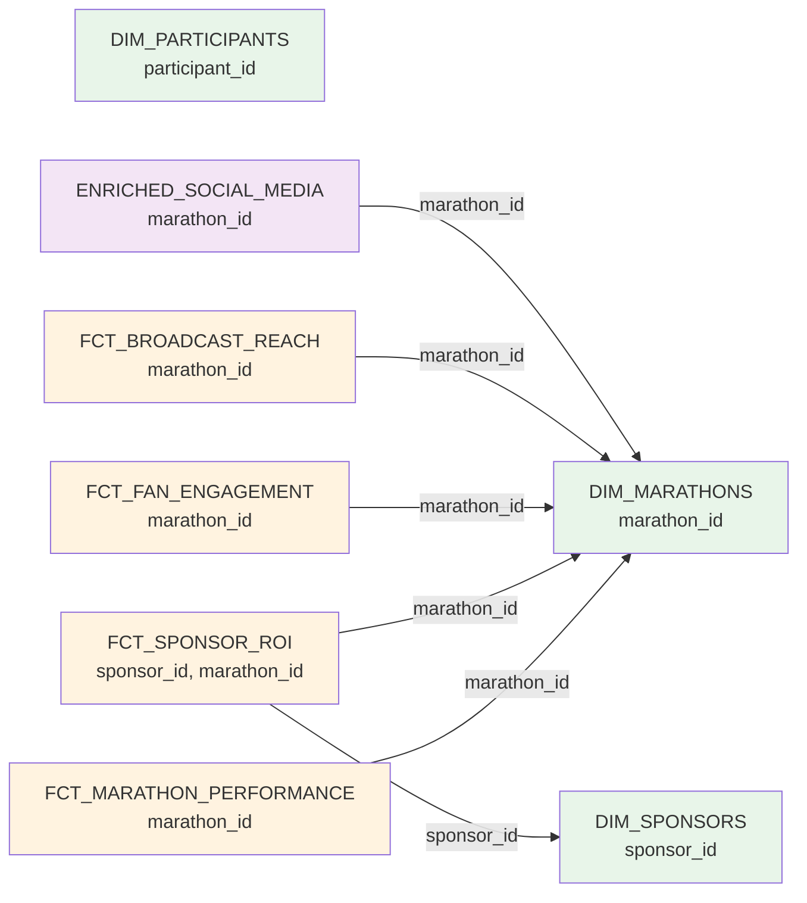

# Data Model - Global Marathon Analytics Demo

**Author:** Michael Whitaker  
**Last Updated:** 2025-11-18  
**Status:** Reference Implementation


**Reference Implementation:** This code demonstrates production-grade architectural patterns and best practices. Review and customize security, networking, and logic for your organization's specific requirements before deployment.

## Overview

This diagram illustrates the complete data model for the marathon analytics demo, showing the flow from raw ingestion through staging and analytics layers to the semantic view that powers Snowflake Intelligence.

## Data Model Architecture

```mermaid
graph TB
    subgraph "RAW_INGESTION Schema - Source Data"
        M[MARATHONS<br/>6 marathons<br/>PK: marathon_id]
        P[PARTICIPANTS<br/>50k runners<br/>PK: participant_id]
        RR[RACE_RESULTS<br/>300k results<br/>PK: result_id<br/>FK: marathon_id, participant_id]
        SP[SPONSORS<br/>8 sponsors<br/>PK: sponsor_id]
        SC[SPONSOR_CONTRACTS<br/>Contracts by year<br/>PK: contract_id<br/>FK: sponsor_id, marathon_id]
        SM[SOCIAL_MEDIA_POSTS<br/>10k posts<br/>PK: post_id<br/>FK: marathon_id]
        BM[BROADCAST_METRICS<br/>TV viewership<br/>PK: broadcast_id<br/>FK: marathon_id]
    end

    subgraph "STAGING Schema - Cleaned Views"
        STG_M[STG_MARATHONS<br/>View: Clean data types]
        STG_P[STG_PARTICIPANTS<br/>View: Standardized names]
        STG_S[STG_SPONSORS<br/>View: Validated tiers]
        STG_SM[STG_SOCIAL_MEDIA<br/>View: Text cleanup]
        STG_BM[STG_BROADCAST_METRICS<br/>View: Flattened regions]
    end

    subgraph "ANALYTICS Schema - Dimensional Model"
        direction TB
        
        subgraph "Dimensions"
            DIM_M[DIM_MARATHONS<br/>Marathon attributes<br/>PK: marathon_id]
            DIM_P[DIM_PARTICIPANTS<br/>Runner profiles<br/>PK: participant_id]
            DIM_S[DIM_SPONSORS<br/>Sponsor details<br/>PK: sponsor_id]
        end
        
        subgraph "Facts - Aggregated"
            FCT_MP[FCT_MARATHON_PERFORMANCE<br/>Per-marathon aggregates<br/>- total_participants<br/>- avg_finish_time_minutes<br/>- fastest_time_minutes<br/>- boston_qualifiers<br/>- qualification_rate_pct<br/>FK: marathon_id]
            
            FCT_SR[FCT_SPONSOR_ROI<br/>Sponsor investment metrics<br/>- contract_value<br/>- activation_spend<br/>- total_investment<br/>- media_exposure_minutes<br/>- cost_per_minute<br/>FK: sponsor_id, marathon_id]

            FCT_FE[FCT_FAN_ENGAGEMENT<br/>Sentiment by marathon/year<br/>- total_posts<br/>- avg_sentiment_score<br/>- total_engagement<br/>- positive_post_pct<br/>FK: marathon_id]

            FCT_BR[FCT_BROADCAST_REACH<br/>Media reach by marathon/year<br/>- total_viewership<br/>- avg_concurrent_viewers<br/>- broadcast_duration_minutes<br/>- broadcast_region_count<br/>FK: marathon_id]
        end
        
        subgraph "Enriched - Cortex AI"
            ENRICH[ENRICHED_SOCIAL_MEDIA<br/>Sentiment analysis<br/>- sentiment_score<br/>- sentiment_category<br/>- engagement_count<br/>FK: marathon_id]
        end
    end

    subgraph "ANALYTICS Schema - Semantic Layer"
        SEM[MARATHON_INSIGHTS<br/>Semantic View<br/><br/>Dimensions 15<br/>- Marathon: name, city, country, difficulty<br/>- Participant: name, gender, age<br/>- Sponsor: name, industry, tier<br/>- Time: race_year<br/>- Social: platform, sentiment<br/><br/>Metrics 11<br/>- Performance: participants, times, qualifiers<br/>- ROI: investment, exposure, efficiency<br/>- Social: posts, sentiment, engagement]
    end

    subgraph "Snowflake Intelligence"
        INTEL[Cortex Analyst<br/>Natural Language Interface<br/><br/>Example Queries:<br/>- Average finish times by marathon<br/>- Sponsor ROI comparison<br/>- Fan sentiment analysis]
    end

    %% Raw to Staging
    M --> STG_M
    P --> STG_P
    SP --> STG_S
    SM --> STG_SM
    BM --> STG_BM

    %% Staging to Analytics - Dimensions
    STG_M --> DIM_M
    STG_P --> DIM_P
    STG_S --> DIM_S

    %% Raw + Staging to Facts
    M --> FCT_MP
    RR --> FCT_MP
    
    SP --> FCT_SR
    SC --> FCT_SR
    M --> FCT_SR
    ENRICH --> FCT_FE
    STG_BM --> FCT_BR

    %% Raw to Enriched
    SM --> ENRICH
    M --> ENRICH

    %% Analytics to Semantic View
    DIM_M --> SEM
    DIM_P --> SEM
    DIM_S --> SEM
    FCT_MP --> SEM
    FCT_SR --> SEM
    FCT_FE --> SEM
    FCT_BR --> SEM
    ENRICH --> SEM

    %% Semantic View to Intelligence
    SEM --> INTEL

    style M fill:#e1f5ff
    style P fill:#e1f5ff
    style RR fill:#e1f5ff
    style SP fill:#e1f5ff
    style SC fill:#e1f5ff
    style SM fill:#e1f5ff
    style BM fill:#e1f5ff
    
    style STG_M fill:#fff4e6
    style STG_P fill:#fff4e6
    style STG_S fill:#fff4e6
    style STG_SM fill:#fff4e6
    style STG_BM fill:#fff4e6
    
    style DIM_M fill:#e8f5e9
    style DIM_P fill:#e8f5e9
    style DIM_S fill:#e8f5e9
    
    style FCT_MP fill:#fff3e0
    style FCT_SR fill:#fff3e0
    style FCT_FE fill:#fff3e0
    style FCT_BR fill:#fff3e0
    
    style ENRICH fill:#f3e5f5
    
    style SEM fill:#e3f2fd
    style INTEL fill:#fce4ec
```



## Layer Details

### Layer 1: RAW_INGESTION (Blue)
**Purpose:** Store unprocessed synthetic data exactly as generated

| Table | Rows | Primary Key | Foreign Keys | Description |
|-------|------|-------------|--------------|-------------|
| `MARATHONS` | 6 | `marathon_id` | - | Marathon events (Tokyo, Boston, London, Berlin, Chicago, NYC) |
| `PARTICIPANTS` | 50,000 | `participant_id` | - | Runner demographics and profiles |
| `RACE_RESULTS` | 300,000 | `result_id` | `marathon_id`, `participant_id` | Individual race finish times and placements |
| `SPONSORS` | 8 | `sponsor_id` | - | Corporate sponsors by tier (Platinum, Gold, Silver) |
| `SPONSOR_CONTRACTS` | ~100 | `contract_id` | `sponsor_id`, `marathon_id` | Annual sponsorship agreements 2023-2025 |
| `SOCIAL_MEDIA_POSTS` | 10,000 | `post_id` | `marathon_id` | Fan posts from Twitter, Instagram, Facebook |
| `BROADCAST_METRICS` | 18 | `broadcast_id` | `marathon_id` | TV viewership data by year |

**Data Generation:** All data created via `GENERATOR()` table function with `UNIFORM()` and `RANDOM()` for realistic variance.

### Layer 2: STAGING (Orange)
**Purpose:** Clean, validate, and standardize raw data

| View | Source | Transformations |
|------|--------|----------------|
| `STG_MARATHONS` | `MARATHONS` | Clean data types, validate marathon_id |
| `STG_PARTICIPANTS` | `PARTICIPANTS` | Standardize names, validate ages |
| `STG_SPONSORS` | `SPONSORS` | Validate sponsorship tiers |
| `STG_SOCIAL_MEDIA` | `SOCIAL_MEDIA_POSTS` | Text cleanup (trim, remove extra spaces) |
| `STG_BROADCAST_METRICS` | `BROADCAST_METRICS` | Expand VARIANT arrays, calculate region counts |

**Pattern:** Views (no data copying) with basic cleaning logic using SQL functions.

### Layer 3: ANALYTICS - Dimensions (Green)
**Purpose:** Slowly changing dimension tables with business-friendly attributes

| Dimension | Source | Key Attributes | Business Purpose |
|-----------|--------|----------------|------------------|
| `DIM_MARATHONS` | `STG_MARATHONS` | name, city, country, difficulty, elevation | Event catalog for filtering |
| `DIM_PARTICIPANTS` | `STG_PARTICIPANTS` | full_name, gender, age, country, experience | Runner demographics |
| `DIM_SPONSORS` | `STG_SPONSORS` | sponsor_name, industry, tier, founding_year | Sponsor profiles |

**Pattern:** Denormalized tables with all descriptive attributes. No transactional data.

### Layer 4: ANALYTICS - Facts (Yellow)
**Purpose:** Aggregated metrics pre-calculated for performance

| Fact Table | Grain | Key Metrics | Source Tables |
|------------|-------|-------------|---------------|
| `FCT_MARATHON_PERFORMANCE` | Per marathon per year | `total_participants`, `avg_finish_time_minutes`, `fastest_time_minutes`, `boston_qualifiers`, `qualification_rate_pct` | `MARATHONS` + `RACE_RESULTS` |
| `FCT_SPONSOR_ROI` | Per sponsor per marathon per year | `contract_value`, `activation_spend`, `total_investment`, `media_exposure_minutes`, `cost_per_minute` | `SPONSORS` + `SPONSOR_CONTRACTS` + `MARATHONS` |
| `FCT_FAN_ENGAGEMENT` | Per marathon per sentiment year | `total_posts`, `avg_sentiment_score`, `positive_post_pct`, `total_engagement`, `avg_engagement_per_post`, `top_platform_by_engagement` | `ENRICHED_SOCIAL_MEDIA` |
| `FCT_BROADCAST_REACH` | Per marathon per broadcast year | `total_viewership`, `avg_concurrent_viewers`, `broadcast_duration_minutes`, `broadcast_region_count` | `BROADCAST_METRICS` + `MARATHONS` |

**Pattern:** Pre-aggregated facts using `GROUP BY` for fast query performance. No row-level detail.

### Layer 5: ANALYTICS - Enriched (Purple)
**Purpose:** AI-enhanced data using Snowflake Cortex and downstream aggregates

| Table | Enrichment | Cortex Function | Output / Consumers |
|-------|------------|-----------------|--------------------|
| `ENRICHED_SOCIAL_MEDIA` | Sentiment Analysis | `SNOWFLAKE.CORTEX.SENTIMENT()` | `sentiment_score`, `sentiment_category`, feeds `FCT_FAN_ENGAGEMENT` |

**Pattern:** Original data + AI-generated columns. Aggregated into `FCT_FAN_ENGAGEMENT` for semantic view performance while retaining post-level drill-down.

### Layer 6: Semantic View (Light Blue)
**Purpose:** Business-friendly metadata layer for natural language queries

**Structure:**
- **Tables (5):** Performance, sponsor ROI, fan engagement, broadcast reach, social detail
- **Relationships (4):** Every fact references performance via `marathon_id`
- **Dimensions (20):** Marathon, sponsor, sentiment year, platforms, broadcast regions
- **Metrics (23):** Performance, sponsorship, fan sentiment, and broadcast reach

**Key Feature:** `WITH SYNONYMS` allows natural language:
- "event name" → `marathons.marathon_name`
- "runner count" → `total_participants` metric
- "sentiment" → `sentiment_category` dimension

### Layer 7: Snowflake Intelligence (Pink)
**Purpose:** Natural language interface powered by Cortex Analyst

**Capabilities:**
- Interprets business questions in plain English
- Maps to semantic view definitions
- Generates optimized SQL automatically
- Returns results in natural language

**Example Flow:**
```
User: "What's the average finish time for Boston?"
  ↓
Cortex Analyst: Maps to semantic view
  - "Boston" → marathons.marathon_name
  - "average finish time" → performance.avg_finish_time metric
  ↓
Generated SQL: 
  SELECT AVG(avg_finish_time_minutes) 
  FROM FCT_MARATHON_PERFORMANCE
  WHERE marathon_name = 'Boston Marathon'
  ↓
Result: "4 hours 23 minutes"
```

## Data Lineage

### From Raw Data to Insights
```
Raw Source → Staging View → Dimension/Fact → Semantic View → Natural Language
─────────────────────────────────────────────────────────────────────────────
MARATHONS → STG_MARATHONS → DIM_MARATHONS ──┐
                                              ├→ MARATHON_INSIGHTS → "Show me marathons in the USA"
RACE_RESULTS ─────────────→ FCT_MARATHON_PERF─┘

SOCIAL_MEDIA_POSTS → STG_SOCIAL_MEDIA → ENRICHED_SOCIAL_MEDIA → FCT_FAN_ENGAGEMENT → MARATHON_INSIGHTS
                                               ↑
                                               └─ Detailed drill-down still available (post-level sentiment)

BROADCAST_METRICS → STG_BROADCAST_METRICS → FCT_BROADCAST_REACH → MARATHON_INSIGHTS → "Which marathon drove the highest viewership?"
```

## Relationships in Semantic View



## Key Design Decisions

### 1. **Why Aggregated Facts?**
- **Performance:** Pre-aggregated data = fast queries
- **Simplicity:** Business users don't need row-level detail
- **Semantic View Compatibility:** Works well with Cortex Analyst's aggregate queries

### 2. **Why Three Layers?**
- **Raw:** Preserve original data (audit trail)
- **Staging:** Clean without data duplication (views)
- **Analytics:** Optimize for querying (tables with aggregations)

### 3. **Why Separate Dimensions?**
- **Reusability:** Same dimension used by multiple facts
- **Consistency:** Single source of truth for attributes
- **Performance:** Smaller dimension tables = faster joins

### 4. **Why Cortex Enrichment?**
- **AI Value:** Demonstrates Snowflake AI capabilities
- **Real Insight:** Sentiment analysis adds business value
- **Native:** No external tools needed

## Query Patterns

### Direct SQL (Traditional)
```sql
-- Complex: Join 3 tables, aggregate, filter
SELECT 
    m.marathon_name,
    AVG(fct.avg_finish_time_minutes) AS avg_time
FROM FCT_MARATHON_PERFORMANCE fct
JOIN DIM_MARATHONS m ON fct.marathon_id = m.marathon_id
WHERE m.country = 'USA'
GROUP BY m.marathon_name;
```

### Semantic View Query (Snowflake Intelligence)
```sql
-- Natural language → Auto-generated SQL
"Show me average finish times for marathons in the USA"
```

## Object Counts

| Layer | Objects | Purpose |
|-------|---------|---------|
| Raw Ingestion | 7 tables | Source data storage |
| Staging | 5 views | Data cleaning |
| Analytics - Dimensions | 3 tables | Business attributes |
| Analytics - Facts | 4 tables | Aggregated metrics |
| Analytics - Enriched | 1 table | AI-enhanced data |
| Semantic Layer | 1 view | Natural language interface |
| **Total** | **21 objects** | Complete data pipeline |

## Change History

See `.cursor/DIAGRAM_CHANGELOG.md` for version history.

---

**Last Updated:** 2025-11-18  
**Maintained By:** Michael Whitaker  
**Related Diagrams:** `data-flow.md`, `network-flow.md`, `auth-flow.md`

