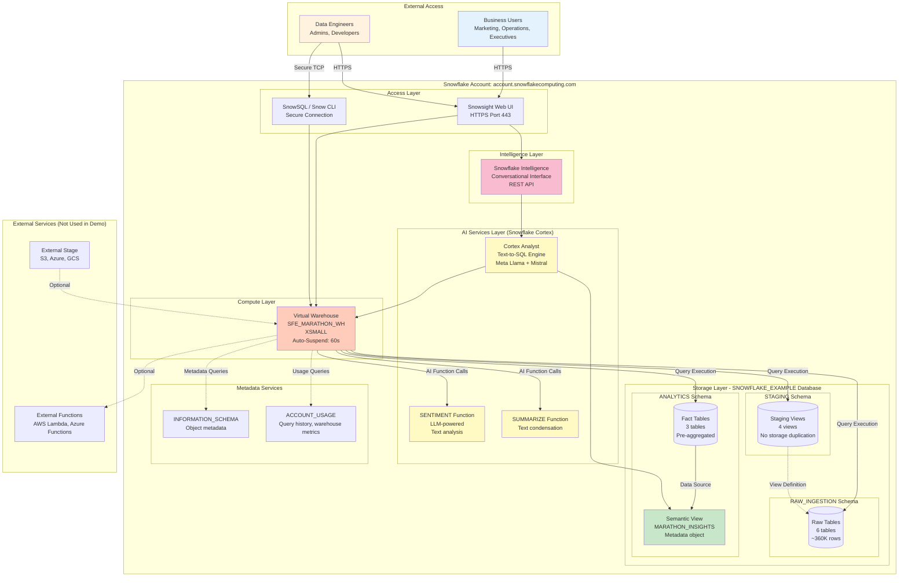

# Network Flow - Global Marathon Analytics Demo

**Author:** Michael Whitaker  
**Last Updated:** 2025-11-17  
**Status:** Reference Implementation


**Reference Implementation:** This code demonstrates production-grade architectural patterns and best practices. Review and customize security, networking, and business logic for your organization's specific requirements before deployment.

---

## Overview

This diagram shows the Snowflake infrastructure architecture and network connectivity for the Global Marathon Analytics demo, including virtual warehouse, database layers, Cortex AI services, and the Snowflake Intelligence interface.

---

## Diagram



---

## Component Descriptions

### External Access

**Component:** Business Users  
**Purpose:** Query data via natural language (Snowflake Intelligence)  
**Access Method:** Snowsight web UI (HTTPS)  
**Location:** Any web browser  
**Dependencies:** Snowflake account credentials, Intelligence access

**Typical Roles:**
- Marketing managers analyzing fan sentiment
- Operations teams tracking marathon performance
- Executives reviewing sponsorship ROI
- Business analysts exploring trends

**Component:** Data Engineers / Admins  
**Purpose:** Develop, deploy, and maintain demo infrastructure  
**Access Method:** Snowsight UI + SnowSQL/Snow CLI  
**Location:** Developer workstations  
**Dependencies:** ACCOUNTADMIN role, CLI tools installed

---

### Access Layer

**Component:** Snowsight Web UI  
**Purpose:** Primary interface for Snowflake Intelligence and SQL queries  
**Technology:** Modern web application (React-based)  
**Protocol:** HTTPS over port 443  
**URL Pattern:** `https://<account>.snowflakecomputing.com`  
**Features:** SQL editor, Intelligence chat, query history, data exploration

**Security:**
- Multi-factor authentication (MFA) supported
- Single Sign-On (SSO) integration
- IP whitelisting (optional)
- Session timeout after inactivity

**Component:** Snowsight Web UI  
**Purpose:** Browser-based SQL worksheet interface for deployment  
**Protocol:** HTTPS  
**Authentication:** Username/password, SSO, or OAuth  
**Usage:** Copy-paste `sql/00_deploy_all.sql` and click "Run All"

---

### Compute Layer

**Component:** SFE_MARATHON_WH Virtual Warehouse  
**Purpose:** Dedicated compute for demo queries and data generation  
**Type:** Standard multi-cluster warehouse (1 cluster for demo)  
**Size:** XSMALL (1 server, 8 compute units)  
**Location:** `sql/01_setup/02_create_warehouse.sql`  
**Dependencies:** Snowflake account, ACCOUNTADMIN role

**Configuration:**
```sql
WAREHOUSE_SIZE = 'XSMALL'     -- Right-sized for demo (50K rows)
AUTO_SUSPEND = 60              -- Suspend after 60 seconds idle
AUTO_RESUME = TRUE             -- Auto-start on query
INITIALLY_SUSPENDED = FALSE    -- Start immediately
COMMENT = 'DEMO: Marathon analytics'
```

**Cost Optimization:**
- XSMALL: 2 credits/hour (~$6/hour at $3/credit)
- Auto-suspend after 60 seconds minimizes waste
- Single cluster (no auto-scaling needed for demo)

**Performance:**
- Sufficient for 50K-300K row queries
- Can scale to SMALL/MEDIUM if needed
- Cold start: 10-15 seconds
- Warm queries: 1-5 seconds

---

### Storage Layer

**Component:** SNOWFLAKE_EXAMPLE Database  
**Purpose:** Demo namespace isolation per standards  
**Type:** Standard Snowflake database  
**Location:** `sql/01_setup/01_create_database.sql`  
**Comment:** `DEMO: Global Marathon Analytics - NOT FOR PRODUCTION`

**Schemas:**

**RAW_INGESTION:**
- Purpose: Landing zone for generated data
- Tables: 6 (marathons, participants, race_results, sponsors, social_media_posts, broadcast_metrics)
- Total Rows: ~360,000
- Storage: ~20 MB compressed

**STAGING:**
- Purpose: Cleaned, typed data
- Objects: 4 views (no physical storage)
- Transformations: Type casting, NULL handling, text normalization
- Query pattern: Views reference RAW_INGESTION tables

**ANALYTICS:**
- Purpose: Business-ready aggregated data
- Tables: 3 (FCT_MARATHON_PERFORMANCE, FCT_SPONSOR_ROI, ENRICHED_SOCIAL_MEDIA)
- Total Rows: ~50,000 (post-aggregation)
- Storage: ~10 MB compressed
- Also contains: MARATHON_INSIGHTS semantic view (metadata only)

---

### AI Services Layer (Snowflake Cortex)

**Component:** SENTIMENT() Function  
**Purpose:** Analyze emotional tone of text  
**Technology:** Large Language Models (LLMs) hosted by Snowflake  
**Endpoint:** `SNOWFLAKE.CORTEX.SENTIMENT(text)`  
**Location:** Called from `sql/03_transformations/03_cortex_enrichment.sql`  
**Dependencies:** CORTEX_USER database role

**Architecture:**
- Multi-tenant compute (no warehouse needed)
- Low-latency inference (<1 second per call)
- Batching supported for efficiency
- Pricing: ~0.10 credits per 1M tokens

**Component:** SUMMARIZE() Function  
**Purpose:** Generate concise text summaries  
**Technology:** LLM-powered abstractive summarization  
**Endpoint:** `SNOWFLAKE.CORTEX.SUMMARIZE(text)`  
**Usage:** Condense long fan reviews or reports

**Component:** Cortex Analyst  
**Purpose:** Natural language to SQL translation  
**Technology:** Meta Llama 3, Mistral 8x7B (model selection automatic)  
**Architecture:** Agentic AI system with semantic understanding  
**Process:**
1. Parse natural language query
2. Reference semantic view for business terminology
3. Generate SQL query
4. Validate syntax and semantics
5. Execute via warehouse
6. Return results with confidence score

**No Data Movement:** All Cortex services run within Snowflake's security perimeter

---

### Intelligence Layer

**Component:** Snowflake Intelligence  
**Purpose:** Conversational analytics interface  
**Technology:** Cortex Analyst + semantic views  
**Access:** Snowsight UI → AI & ML → Snowflake Intelligence  
**Alternative:** REST API for programmatic access

**Features:**
- Natural language query understanding
- Automatic SQL generation
- Verification shields (trust indicators)
- Query history and context awareness
- Integration with Microsoft Teams, Slack

**Configuration:**
- Agent: "Marathon Analytics"
- Connected semantic view: `SNOWFLAKE_EXAMPLE.ANALYTICS.MARATHON_INSIGHTS`
- Model selection: Automatic (optimized per query)

---

### Metadata Services

**Component:** INFORMATION_SCHEMA  
**Purpose:** Real-time object metadata  
**Tables:** Objects, columns, tables, views, schemas, databases  
**Usage:** Semantic view references table schemas  
**Latency:** Real-time (no caching)

**Component:** ACCOUNT_USAGE  
**Purpose:** Historical account activity and usage  
**Tables:** Query_history, warehouse_metering_history, storage_usage  
**Usage:** Performance monitoring, cost analysis  
**Latency:** Up to 2 hours (cached/replicated)

---

## Network Flow Patterns

### Query Execution Flow

```
User → Snowsight → Intelligence → Cortex Analyst
                                      ↓
                          (Semantic View Reference)
                                      ↓
                          (SQL Generation)
                                      ↓
                      Warehouse → Tables → Results
                                      ↓
                      Intelligence → User
```

**Latency Breakdown:**
1. User types question: 0ms
2. Analyst interprets + generates SQL: 1-2 seconds
3. Warehouse executes query: 1-3 seconds
4. Results returned to UI: 0.5 seconds
5. Total: 2-5 seconds typical

### Data Generation Flow

```
Admin → SnowSQL → Warehouse → GENERATOR() Function
                                      ↓
                          (Bulk Insert)
                                      ↓
                  RAW_INGESTION Tables (Micro-Partitions)
```

**Performance:**
- 50,000 rows: 5-10 seconds
- 300,000 rows: 30-45 seconds
- Limited by XSMALL warehouse size

### Cortex AI Enrichment Flow

```
Warehouse → RAW Table → SENTIMENT() Function
                              ↓
                    (LLM Inference)
                              ↓
                Cortex Multi-Tenant Compute
                              ↓
                    (Sentiment Score)
                              ↓
                ANALYTICS Table (Stored Result)
```

**One-time cost:** Analyze 10,000 posts = ~1M tokens = 0.10 credits

---

## Security Architecture

### Network Security

**Encryption:**
- All data in transit: TLS 1.2+
- All data at rest: AES-256
- No unencrypted traffic

**Firewall Rules:**
- Inbound: HTTPS (443) only
- Outbound: Snowflake services, Cortex endpoints
- Optional: IP whitelisting for admin access

**Private Connectivity:**
- AWS PrivateLink supported (not used in demo)
- Azure Private Link supported (not used in demo)
- Keeps traffic within cloud provider backbone

### Access Control

**Authentication:**
- Username/password (MFA recommended)
- Key-pair authentication for CLI
- OAuth/SAML SSO for enterprise

**Authorization:**
- Role-Based Access Control (RBAC)
- Warehouse usage grants
- Semantic view privileges
- No direct table access needed for Intelligence users

---

## High Availability & Disaster Recovery

### Replication (Not Configured in Demo)

**Database Replication:**
- Primary region: Account region
- Secondary region: Configure replication group
- Failover: Manual or automatic

### Time Travel (Configured)

**Data Recovery:**
- Retention: 1 day (default for demo)
- Can extend to 90 days (Enterprise Edition)
- Query historical data: `SELECT * FROM table AT(OFFSET => -3600);`

### Fail-Safe (Permanent Tables Only)

**Disaster Recovery:**
- 7-day fail-safe period after Time Travel
- Snowflake support required for recovery
- Not applicable to TRANSIENT tables

---

## Scalability Considerations

### Horizontal Scaling

**Warehouse Scaling:**
```sql
-- Scale up for larger data volumes
ALTER WAREHOUSE SFE_MARATHON_WH SET WAREHOUSE_SIZE = 'MEDIUM';

-- Scale out for concurrency
ALTER WAREHOUSE SFE_MARATHON_WH SET MAX_CLUSTER_COUNT = 3;
```

**When to Scale:**
- XSMALL: <100K rows, <10 concurrent users
- SMALL: 100K-1M rows, 10-50 concurrent users
- MEDIUM: 1M-10M rows, 50-100 concurrent users

### Data Volume Scaling

**Current:** 360K rows, 30 MB  
**10x Scale:** 3.6M rows, 300 MB (still XSMALL)  
**100x Scale:** 36M rows, 3 GB (recommend SMALL-MEDIUM)  
**1000x Scale:** 360M rows, 30 GB (recommend LARGE+ with clustering)

---

## Cost Architecture

### Compute Costs

**Warehouse:**
- XSMALL: 2 credits/hour
- Actual usage: ~0.1-0.2 credits/hour (with 60s auto-suspend)
- Daily cost: ~$0.50-$1.00 (assuming $3/credit)

**Cortex AI:**
- Sentiment analysis: 0.10 credits per 1M tokens
- One-time cost for 10K posts: ~$0.30
- Ongoing queries: $0 (already computed)

**Intelligence:**
- Included with Snowflake account (no additional cost per query)

### Storage Costs

**Database:**
- Compressed size: ~30 MB
- Monthly cost: ~$0.07 (at $23/TB/month)
- Negligible for demo purposes

**Time Travel:**
- 1-day retention: Minimal overhead
- 90-day retention: Would increase storage 90x

---

## Monitoring & Observability

### Query Performance

```sql
-- View recent queries
SELECT 
  query_text,
  total_elapsed_time / 1000 AS exec_time_sec,
  warehouse_name,
  user_name
FROM SNOWFLAKE.ACCOUNT_USAGE.QUERY_HISTORY
WHERE start_time >= DATEADD('hour', -1, CURRENT_TIMESTAMP())
ORDER BY start_time DESC;
```

### Warehouse Utilization

```sql
-- View warehouse credits used
SELECT 
  warehouse_name,
  SUM(credits_used) AS total_credits,
  SUM(credits_used) * 3 AS estimated_cost_usd
FROM SNOWFLAKE.ACCOUNT_USAGE.WAREHOUSE_METERING_HISTORY
WHERE start_time >= DATEADD('day', -7, CURRENT_TIMESTAMP())
GROUP BY warehouse_name;
```

### Intelligence Usage

**Via Snowsight:**
- AI & ML → Snowflake Intelligence → Agent → Activity tab
- Shows query count, success rate, average response time

---

## Change History

See `.cursor/DIAGRAM_CHANGELOG.md` for version history and architecture decisions.

---

**Last Updated:** 2025-11-17  
**Next:** See `auth-flow.md` for security and access control details

